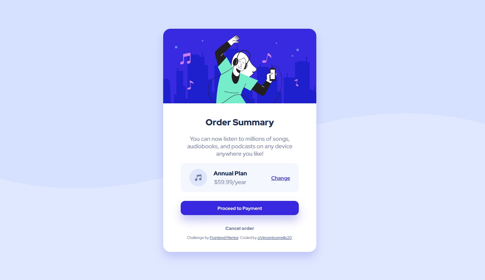

# Frontend Mentor - Order summary card solution

This is a solution to the [Order summary card challenge on Frontend Mentor](https://www.frontendmentor.io/challenges/order-summary-component-QlPmajDUj). Frontend Mentor challenges help you improve your coding skills by building realistic projects. 

## Table of contents

- [Overview](#overview)
  - [The challenge](#the-challenge)
  - [Screenshot](#screenshot)
  - [Links](#links)
- [My process](#my-process)
  - [Built with](#built-with)
  - [What I learned](#what-i-learned)
  - [Continued development](#continued-development)
  - [Useful resources](#useful-resources)
- [Author](#author)

## Overview

### The challenge

Users should be able to:

- See hover states for interactive elements

### Screenshot

### Links

- Solution URL: [Add solution URL here](https://your-solution-url.com)
- Live Site URL: [Add live site URL here](https://your-live-site-url.com)

## My process

### Built with

- Semantic HTML5 markup
- CSS custom properties
- Flexbox
- Responsive units (rem)
- Google Fonts

### What I learned

During this challenge, I practiced styling elements with hover states, such as buttons and interactive items. This helped me understand how to create a more dynamic user experience.

I also shifted from using fixed pixel values to responsive units like rem, which made the layout scale better across different screen sizes. This gave me a better understanding of responsive design and how to build pages that adapt more smoothly.

### Continued development

For future projects, I want to deepen my understanding of responsive layouts, improve component structure, and continue practicing advanced CSS techniques. I also want to start organizing my CSS in a more scalable way as projects become larger.

### Useful resources

- (https://www.youtube.com/watch?v=SR5GxoFhIAUm)

## Author

- Frontend Mentor - [@Vincentcornello20](https://www.frontendmentor.io/profile/Vincentcornello20)
